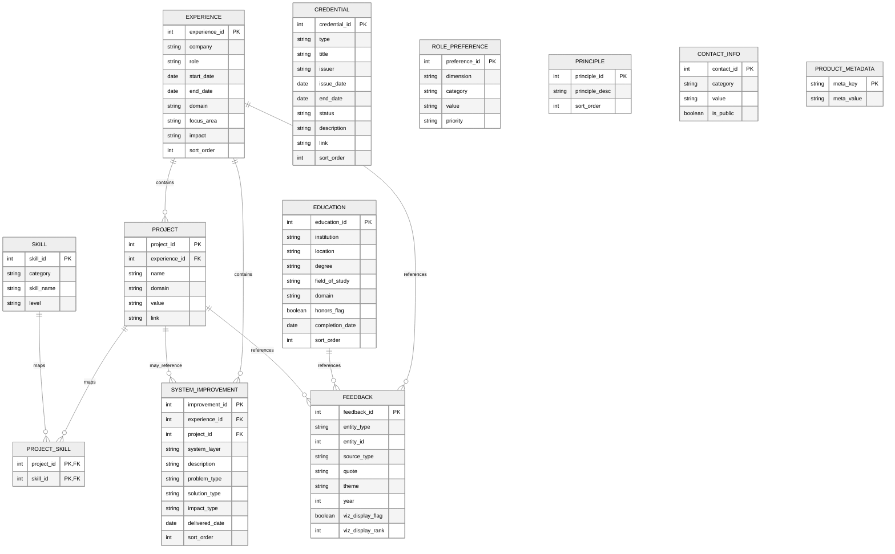
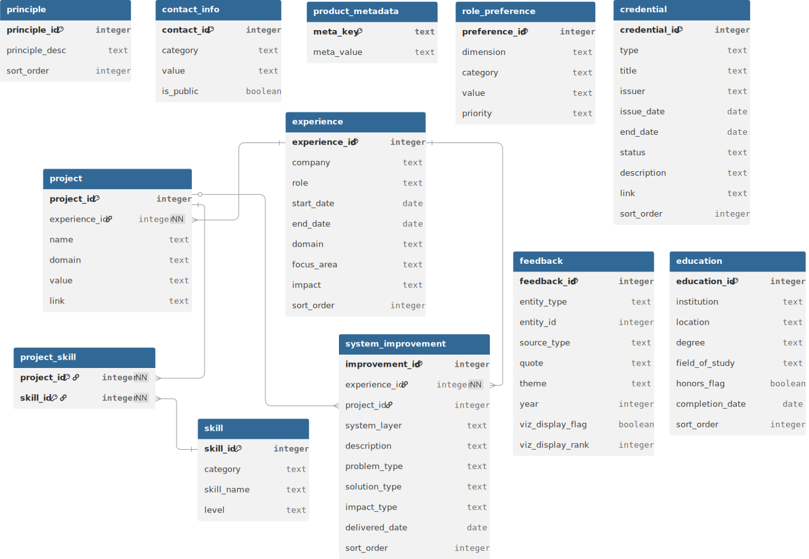

# Human Data Product Schema

This schema models professional experience as a structured data product.

Key design principles:
- Experience represents roles held over time
- Projects capture key initiatives within each role
- Skills are normalized and mapped through a join table
- Feedback and principles support insight generation
- Metadata enables the site to behave like a real data product catalog
- System improvements capture delivered lower-grain changes that show how systems were expanded, stabilized, or made easier to consume over time

## Modeling Approach

- Normalized relational structure using SQLite
- Entity-based modeling (experience, projects, skills)
- Derived analytical views created via SQL
- Designed for both API access and analytical querying

### Key Relationships

- experience → project
- project → project_skill → skill
- experience → feedback
- education → feedback
- project → feedback
- experience → system_improvement
- project → system_improvement (optional reference)

Projects belong to an experience, and each project can reference multiple skills through the project_skill join table. System improvements belong to an experience and can optionally reference a parent project when the delivered change was part of a larger initiative.

---
## Entity Relationship Diagrams

The schema centers on professional experience as the primary domain entity.
Projects and skills describe technical work, while feedback and preferences provide signals by the insight layer of the data product.

### Inline ERD (Mermaid)
The diagram below provides a lightweight, embedded view of the core relationships in the schema for quick reference within the documentation.

### Full ERD (dbdiagram.io)
The diagram below represents the full entity relationship model used during schema design. It includes layout optimizations and annotations not easily expressed in Mermaid.
This diagram is the authoritative visual reference for the Human Data Product schema.

---
## Database Architecture

### experience
Primary domain entity representing roles over time
| Column        | Type    | Key | Notes                                             |
| ------------- | ------- | --- | ------------------------------------------------- |
| experience_id | INTEGER | PK  | Unique identifier for experience                  |
| company       | TEXT    |     | Company name                                      |
| role          | TEXT    |     | Role title                                        |
| start_date    | DATE    |     | Start date ISO YYYY-MM-DD Format                  |
| end_date      | DATE    |     | End date (NULL if current) ISO YYYY-MM-DD Format  |
| domain        | TEXT    |     | Business or technology domain                     |
| focus_area    | TEXT    |     | Primary focus area of the role                    |
| impact        | TEXT    |     | Summary of impact or achievements                 |
| sort_order    | INTEGER |     | Controls display order                            |

### education
Formal education history
| Column          | Type    | Key | Notes                                                                        |
| --------------- | ------- | --- | ---------------------------------------------------------------------------- |
| education_id    | INTEGER | PK  | Unique identifier                                                            |
| institution     | TEXT    |     | School / institution name                                                    |
| location        | TEXT    |     | City, State (or Country)                                                     |
| degree          | TEXT    |     | Degree earned (e.g., BS, BA, MS)                                             |
| field_of_study  | TEXT    |     | Major / concentration                                                        |
| domain          | TEXT    |     | Optional: thematic domain (e.g., Business, Analytics)                        |
| honors_flag     | BOOLEAN |     | TRUE if honors/distinction applies                                           |
| completion_date | DATE    |     | Graduation / completion date (use NULL if in progress) ISO YYYY-MM-DD Format |
| sort_order      | INTEGER |     | Controls display order                                                       |

### project
Key initiatives or work performed during an experience
| Column        | Type    | Key | Notes                                 |
| ------------- | ------- | --- | ------------------------------------- |
| project_id    | INTEGER | PK  | Unique identifier for project         |
| experience_id | INTEGER | FK  | References `experience.experience_id` |
| name          | TEXT    |     | Project name                          |
| domain        | TEXT    |     | Domain or subject area                |
| value         | TEXT    |     | Description of value delivered        |
| link          | TEXT    |     | Optional external reference           |

### system_improvement
Delivered system-level changes performed within an experience, optionally linked to a larger project
| Column          | Type    | Key     | Notes                                                                                 |
|-----------------|---------|---------|---------------------------------------------------------------------------------------|
| improvement_id  | INTEGER | PK      | Unique identifier for system improvement                                              |
| experience_id   | INTEGER | FK      | References `experience.experience_id`                                                 |
| project_id      | INTEGER | FK      | Optional reference to `project.project_id`                                            |
| system_layer    | TEXT    |         | Primary system layer affected (`data`, `workflow`, `integration`, `UI`, `governance`) |
| description     | TEXT    |         | Normalized description of the delivered change                                        |
| problem_type    | TEXT    |         | Normalized problem category                                                           |
| solution_type   | TEXT    |         | Normalized solution category                                                          |
| impact_type     | TEXT    |         | Normalized impact category                                                            |
| delivered_date  | DATE    |         | Delivery date in ISO YYYY-MM-DD format                                                |
| sort_order      | INTEGER |         | Deterministic display / load order                                                    |

### role_preference
Preferences describing ideal future roles
| Column        | Type    | Key | Notes                                                   |
| ------------- | ------- | --- | ------------------------------------------------------- |
| preference_id | INTEGER | PK  | Unique identifier                                       |
| dimension     | TEXT    |     | Categorial grouping axes                                |
| category      | TEXT    |     | Preference category (location, work_mode, domain, etc.) |
| value         | TEXT    |     | Preference value                                        |
| priority      | TEXT    |     | Importance level (high, medium, low)                    |

### skill
Normalized skill catalog
| Column      | Type    | Key | Notes                                                         |
| ----------- | ------- | --- | ------------------------------------------------------------- |
| skill_id    | INTEGER | PK  | Unique identifier                                             |
| category    | TEXT    |     | Skill category (data, platform, architecture, etc.)           |
| skill_name  | TEXT    |     | Skill name                                                    |
| level       | TEXT    |     | Proficiency level (beginner, intermediate, advanced, expert)  |

### credential
Professional certifications, courses, or credentials
| Column        | Type    | Key | Notes                                                     |
| ------------- | ------- | --- | --------------------------------------------------------- |
| credential_id | INTEGER | PK  | Unique identifier                                         |
| type          | TEXT    |     | Credential type (certification, course, badge, license)   |
| title         | TEXT    |     | Credential name/title                                     |
| issuer        | TEXT    |     | Issuing organization (SAP, Microsoft, etc.)               |
| issue_date    | DATE    |     | Date issued (NULL if in progress) ISO YYYY-MM-DD Format   |
| end_date      | DATE    |     | Expiration/end date (NULL if none) ISO YYYY-MM-DD Format  |
| status        | TEXT    |     | Status (active, in_progress, expired)                     |
| description   | TEXT    |     | Optional short description of relevance                   |
| link          | TEXT    |     | Optional URL (credential verification, course page, etc.) |
| sort_order    | INTEGER |     | Controls display order                                    |

### project_skill
Join table mapping projects to skills
| Column     | Type    | Key     | Notes                           |
| ---------- | ------- | ------- | ------------------------------- |
| project_id | INTEGER | PK / FK | References `project.project_id` |
| skill_id   | INTEGER | PK / FK | References `skill.skill_id`     |

**Composite Primary Key:** (project_id, skill_id)

This table represents a **many-to-many relationship** between projects and skills.

### principle
Architecture or professional principles
| Column         | Type    | Key | Notes                                |
| -------------- | ------- | --- | ------------------------------------ |
| principle_id   | INTEGER | PK  | Unique identifier                    |
| principle_desc | TEXT    |     | Architecture or philosophy principle |
| sort_order     | INTEGER |     | Controls display order               |

### contact_info
Contact information exposed through API
| Column     | Type    | Key | Notes                                      |
| ---------- | ------- | --- | ------------------------------------------ |
| contact_id | INTEGER | PK  | Unique identifier                          |
| category   | TEXT    |     | Contact type (email, linkedin, website)    |
| value      | TEXT    |     | Contact value                              |
| is_public  | BOOLEAN |     | Determines whether field is exposed in API |

### feedback
Peer or leadership feedback tied to a specific experience
| Column           | Type              | Key | Notes                                                                         |
| -----------      | -------           | --- | ----------------------------------------------------------------------------- |
| feedback_id      | INTEGER           | PK  | Unique identifier                                                             |
| entity_type      | TEXT              |     | Target entity type (experience, education, project, credential)               |
| entity_id        | INTEGER           |     | Target entity id (validated by loader; not a DB-enforced FK)                  |
| source_type      | TEXT              |     | Source of feedback (manager, peer, stakeholder, linkedin)                     |
| quote            | TEXT              |     | Feedback quote (consider trimming names/private details)                      |
| theme            | TEXT              |     | Theme (architecture, execution, leadership, collaboration, growth, strategy)  |
| year             | INTEGER           |     | Year feedback was given                                                       |
| viz_display_flag | INTEGER / BOOLEAN |     |Indicates whether the record is included in the curated default drilldown view |
| viz_display_rank | INTEGER           |     | Rank order within the curated subset; null for non-curated records            |

**entity_type** should be one of: experience, education, project, credential
entity_id must exist in the corresponding table (enforced in your load_data.py validation step)

#### Curated feedback presentation metadata

The feedback entity includes optional presentation metadata used by the frontend drilldown experience.

- `viz_display_flag = 1` identifies records shown by default in theme drilldowns
- `viz_display_rank` controls the order of curated records
- All feedback records still participate in aggregate theme counts and analytics

### product_metadata
Metadata describing the Human Data Product
| Column     | Type | Key | Notes                                                          |
| ---------- | ---- | --- | -------------------------------------------------------------- |
| meta_key   | TEXT | PK  | Metadata key (version, product status, last refresh timestamp) |
| meta_value | TEXT |     | Metadata value                                                 |
