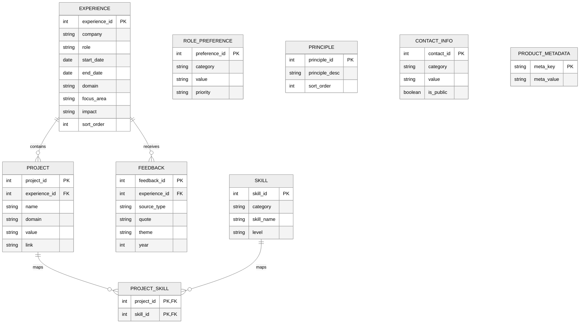
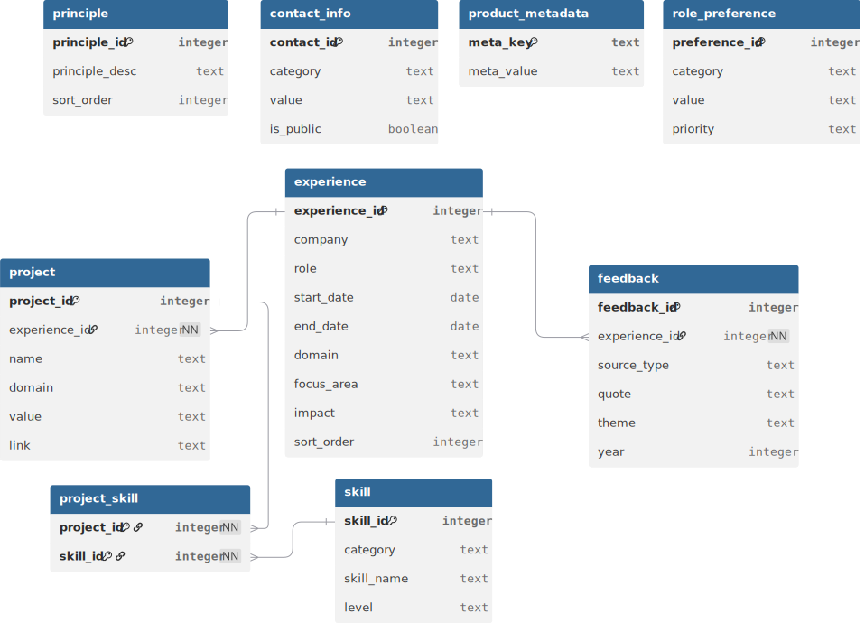

# Human Data Product Schema

This schema models professional experience as a structured data product.

Key design principles:
- Experience represents roles held over time
- Projects capture key initiatives within each role
- Skills are normalized and mapped through a join table
- Feedback and principles support insight generation
- Metadata enables the site to behave like a real data product catalog****

## Key Relationships

experience → project  
project → project_skill → skill  
experience → feedback  

Projects belong to an experience, and each project can reference multiple skills through the project_skill join table.

---
## Entity Relationship Diagrams

The schema centers on professional experience as the primary domain entity.
Projects and skills describe technical work, while feedback and preferences provide signals by the insight layer of the data product.

### Inline ERD (Mermaid)
The diagram below provides a lightweight, embedded view of the core relationships in the schema for quick reference within the documentation.

### Full ERD (dbdiagram.io)
The diagram below represents the full entity relationship model used during schema design. It includes layout optimizations and annotations not easily expressed in Mermaid.
This diagram is the authoritative visual reference for the Human Data Product schema.

---

## experience
Primary domain entity representing roles over time
| Column        | Type    | Key | Notes                             |
| ------------- | ------- | --- | --------------------------------- |
| experience_id | INTEGER | PK  | Unique identifier for experience  |
| company       | TEXT    |     | Company name                      |
| role          | TEXT    |     | Role title                        |
| start_date    | DATE    |     | Start date                        |
| end_date      | DATE    |     | End date (NULL if current)        |
| domain        | TEXT    |     | Business or technology domain     |
| focus_area    | TEXT    |     | Primary focus area of the role    |
| impact        | TEXT    |     | Summary of impact or achievements |
| sort_order    | INTEGER |     | Controls display order            |

## project
Key initiatives or work performed during an experience
| Column        | Type    | Key | Notes                                 |
| ------------- | ------- | --- | ------------------------------------- |
| project_id    | INTEGER | PK  | Unique identifier for project         |
| experience_id | INTEGER | FK  | References `experience.experience_id` |
| name          | TEXT    |     | Project name                          |
| domain        | TEXT    |     | Domain or subject area                |
| value         | TEXT    |     | Description of value delivered        |
| link          | TEXT    |     | Optional external reference           |

## role_preference
Preferences describing ideal future roles
| Column        | Type    | Key | Notes                                                   |
| ------------- | ------- | --- | ------------------------------------------------------- |
| preference_id | INTEGER | PK  | Unique identifier                                       |
| category      | TEXT    |     | Preference category (location, work_mode, domain, etc.) |
| value         | TEXT    |     | Preference value                                        |
| priority      | TEXT    |     | Importance level (high, medium, low)                    |

## skill
Normalized skill catalog
| Column      | Type    | Key | Notes                                                         |
| ----------- | ------- | --- | ------------------------------------------------------------- |
| skill_id    | INTEGER | PK  | Unique identifier                                             |
| category    | TEXT    |     | Skill category (data, platform, architecture, etc.)           |
| skill_name  | TEXT    |     | Skill name                                                    |
| level       | TEXT    |     | Proficiency level (beginner, intermediate, advanced, expert)  |

## project_skill
Join table mapping projects to skills
| Column     | Type    | Key     | Notes                           |
| ---------- | ------- | ------- | ------------------------------- |
| project_id | INTEGER | PK / FK | References `project.project_id` |
| skill_id   | INTEGER | PK / FK | References `skill.skill_id`     |

**Composite Primary Key:** (project_id, skill_id)

This table represents a **many-to-many relationship** between projects and skills.

## principle
Architecture or professional principles
| Column         | Type    | Key | Notes                                |
| -------------- | ------- | --- | ------------------------------------ |
| principle_id   | INTEGER | PK  | Unique identifier                    |
| principle_desc | TEXT    |     | Architecture or philosophy principle |
| sort_order     | INTEGER |     | Controls display order               |

## contact_info
Contact information exposed through API
| Column     | Type    | Key | Notes                                      |
| ---------- | ------- | --- | ------------------------------------------ |
| contact_id | INTEGER | PK  | Unique identifier                          |
| category   | TEXT    |     | Contact type (email, linkedin, website)    |
| value      | TEXT    |     | Contact value                              |
| is_public  | BOOLEAN |     | Determines whether field is exposed in API |

## feedback
Peer or leadership feedback tied to a specific experience
| Column        | Type    | Key | Notes                                                              |
| ------------- | ------- | --- | ------------------------------------------------------------------ |
| feedback_id   | INTEGER | PK  | Unique identifier                                                  |
| experience_id | INTEGER | FK  | References `experience.experience_id`                              |
| source_type   | TEXT    |     | Source of feedback (manager, peer, stakeholder, customer, partner) |
| quote         | TEXT    |     | Feedback quote                                                     |
| theme         | TEXT    |     | Feedback theme (architecture, leadership, collaboration)           |
| year          | INTEGER |     | Year feedback was given                                            |

## product_metadata
Metadata describing the Human Data Product
| Column     | Type | Key | Notes                                                          |
| ---------- | ---- | --- | -------------------------------------------------------------- |
| meta_key   | TEXT | PK  | Metadata key (version, product status, last refresh timestamp) |
| meta_value | TEXT |     | Metadata value                                                 |
